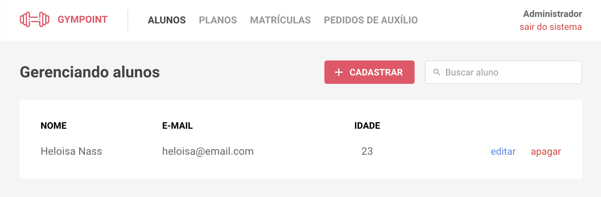

# gympoint-frontend
Gym management application (registrations/check-ins)

[](https://app.netlify.com/sites/sad-goldberg-d09b8b/deploys)

[Preview](docs/preview.png)

<a href="https://gympoint.santospatrick.com/" rel="Facebook posts site preview"></a>

## Desenvolvimento
1. Crie um  arquivo `.env.development.local` (preenchendo as variáveis encontradas no `.env.example`)

2. Inicie o servidor local
```bash
yarn
yarn start
```
